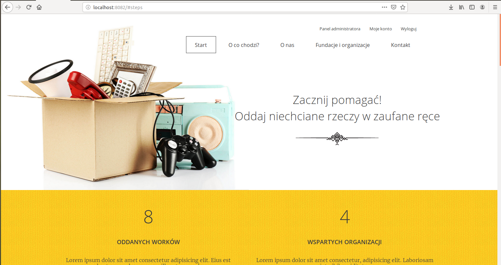
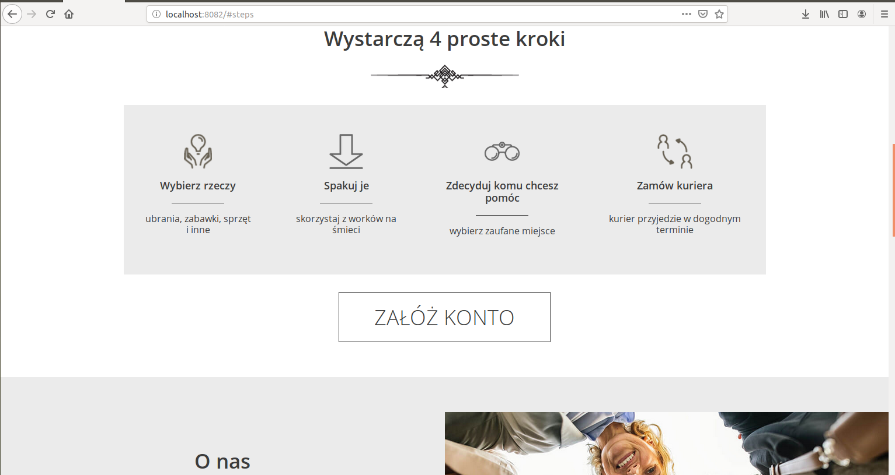
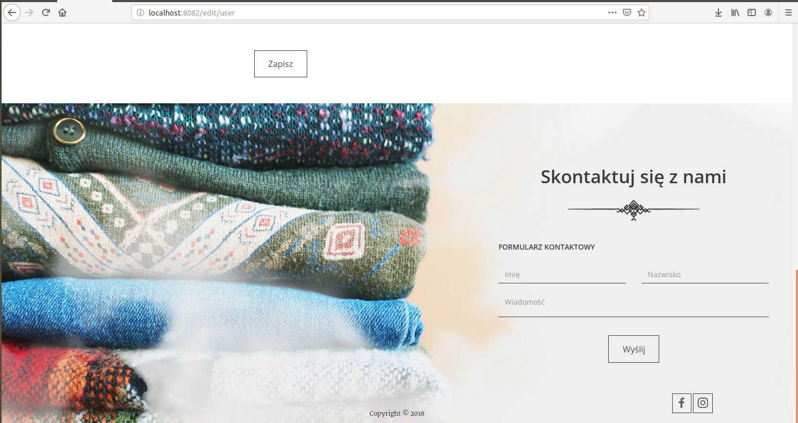
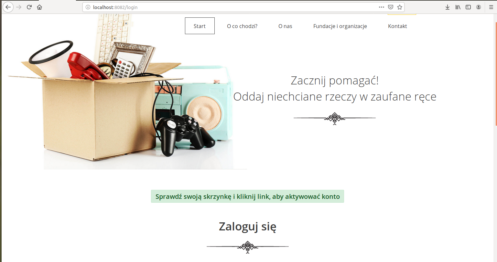
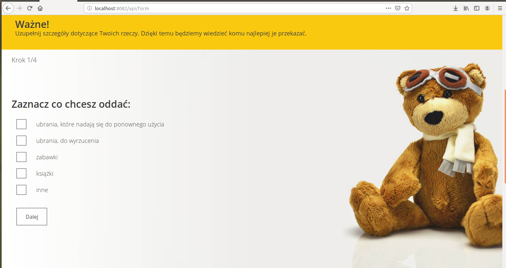
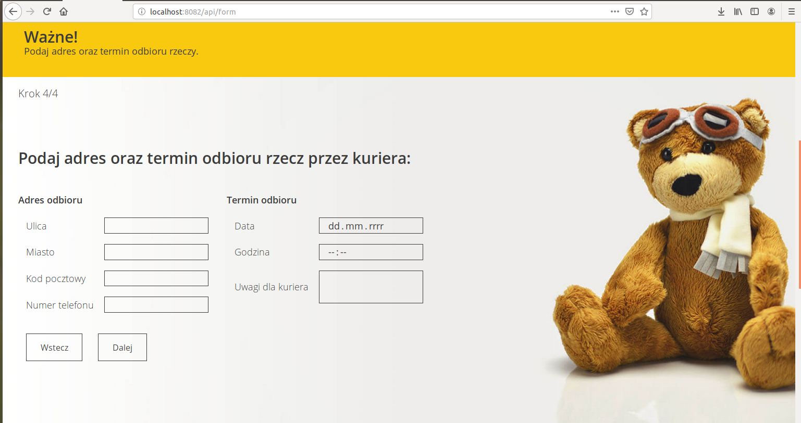
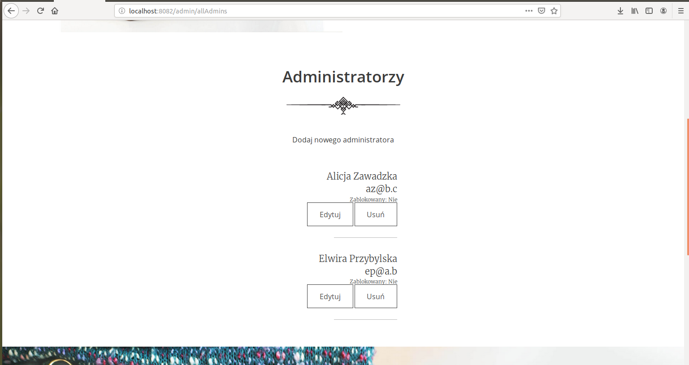

## Charity
Java project using Spring Boot, Spring Form, Hibernate, Spring Data JPA.

This application allows you to give your old things like clothes, books, toys to charity organizations. 
You can choose which of them will be donated and when the package should be taken from you.
To use it you need to create an account and activate it by clicking a link, which you will get on your email address.
After that, you can log in and fill up a form where you declare what you want to give, to whom, 
when and where should courier come for it.
You can always edit your data, change a password, or check your former donations.

